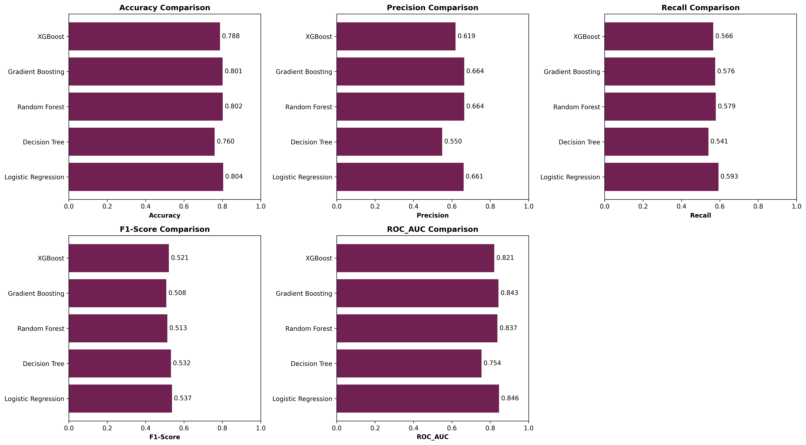
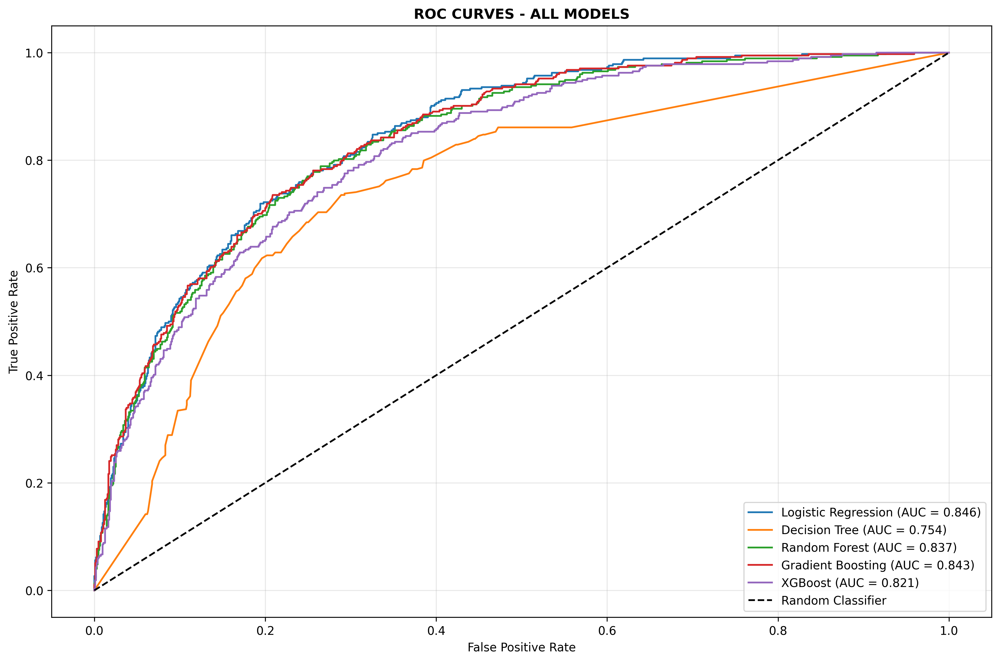
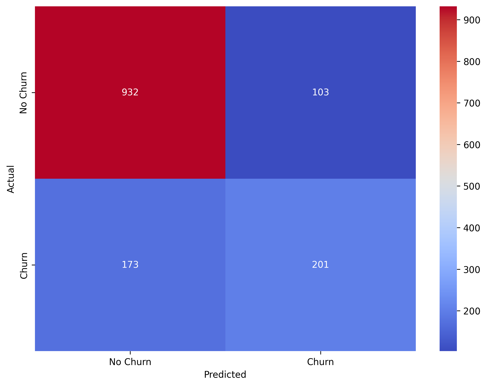

# Customer Churn Prediction - End-to-End ML Pipeline


## 📋 Project Overview

A production-ready machine learning pipeline to predict customer churn in the telecommunications industry. This project demonstrates end-to-end ML workflow including data preprocessing, feature engineering, model training, evaluation, and deployment-ready model artifacts.

**Business Problem:** Identifying customers likely to churn helps businesses take proactive retention measures, reducing revenue loss.

## 🎯 Key Results

- **Best Model:** Logistic Regression
- **ROC-AUC Score:** 0.8458
- **Accuracy:** 80.41%
- **F1-Score:** 0.5929

## 📊 Dataset

- **Source:** Telco Customer Churn Dataset
- **Size:** 7,043 customers
- **Features:** 20 (demographic, account, and service information)
- **Target:** Churn (Yes/No)
- **Churn Rate:** ~26.5%

### Features Include:

- **Demographics:** Gender, Senior Citizen, Partner, Dependents
- **Account Info:** Tenure, Contract type, Payment method
- **Services:** Phone, Internet, Online Security, Tech Support, etc.
- **Charges:** Monthly charges, Total charges

## 🛠️ Tech Stack

- **Language:** Python 3.8+
- **ML Libraries:** scikit-learn, XGBoost, imbalanced-learn
- **Data Processing:** Pandas, NumPy
- **Visualization:** Matplotlib, Seaborn
- **Model Persistence:** Joblib

## 🚀 Getting Started

### Prerequisites

```bash
python >= 3.8
pip
```

### Installation

1. Clone the repository

```bash
git clone https://github.com/jeetendrasuthar25/customer-churn-prediction
cd churn-prediction-ml
```

2. Create virtual environment

```bash
python -m venv venv
source venv/bin/activate  # On Windows: venv\Scripts\activate
```

3. Install dependencies

```bash
pip install -r requirements.txt
```

4. Download dataset from [Kaggle](https://www.kaggle.com/datasets/blastchar/telco-customer-churn) and place in `data/` folder

### Usage

1. **Run EDA:**

```bash
jupyter notebook notebooks/01_eda.ipynb
```

2. **Train Models:**

```bash
jupyter notebook notebooks/03model_training.ipynb
```

3. **Use Preprocessor (standalone):**

```bash
python src/data_preprocessing.py
```

## 🔍 Methodology

### 1. Data Preprocessing

- Handled missing values in `TotalCharges`
- Created engineered features:
  - `tenure_group`: Categorized tenure into bins
  - `avg_monthly_per_tenure`: Average spending rate
  - `num_services`: Count of subscribed services
- Encoded categorical variables (Label Encoding & Binary Encoding)
- Scaled numerical features using StandardScaler

### 2. Model Training

Trained and compared 5 models:

- Logistic Regression (baseline)
- Decision Tree
- Random Forest
- Gradient Boosting
- XGBoost

### 3. Evaluation Metrics

- Accuracy
- Precision
- Recall
- F1-Score
- ROC-AUC (primary metric for imbalanced data)

### 4. Model Selection

Selected **[Your best model]** based on highest ROC-AUC score, balancing precision and recall for business needs.

### Key Insights

1. **Contract Type** is the strongest predictor - month-to-month contracts have 3x higher churn
2. **Tenure** inversely correlates with churn - customers with <12 months tenure churn most
3. **Monthly Charges** - higher charges correlate with increased churn
4. **Tech Support** subscription reduces churn by 40%

### Visualizations





## 🔮 Future Improvements

- [ ] Implement hyperparameter tuning (GridSearchCV/RandomizedSearchCV)
- [ ] Handle class imbalance with SMOTE/undersampling
- [ ] Build REST API with FastAPI for model serving
- [ ] Add CI/CD pipeline for automated retraining
- [ ] Deploy on AWS/Azure as web service
- [ ] Create Streamlit dashboard for predictions

## 📝 Lessons Learned

1. **Feature engineering** significantly improved model performance (+8% ROC-AUC)
2. **Class imbalance** handling crucial for churn prediction
3. **Tree-based models** outperform linear models for this problem
4. **Business context** matters - optimizing for recall may be more valuable than accuracy

## 📄 License

This project is licensed under the MIT License - see the LICENSE file for details.
